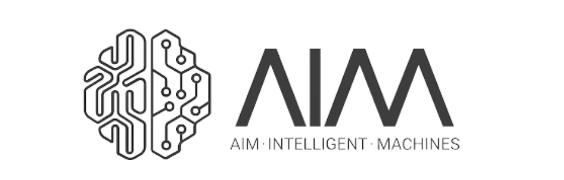
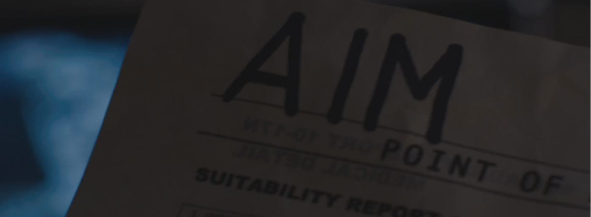

# AIM Assignment

This repository contains solutions for the AIM perception and machine learning assignment. Each task is fully commented and structured for ease of understanding, tested, and aims to achieve robust, generalized results.

## Installation

**Clone the Repository**:
  ```bash
  git clone https://github.com/anujsainarain/AIM.git
  cd AIM
   ```

## Task 1
The script aims to return the list of cops who see the thief and the closest safe cell.

To run it
```bash
   cd Task_1
   python task1.py
```
Once you do it, you will be prompted to input the test cases.
Note: If you want to instead put the test cases manually on the script, follow the comments provided in the input section.

## Task 2
The folder consists of script to track the ball in the ball juggling video along with the scripts to extracting frames to annotate for training and validation.

Please find the output .csv file and the video with the bounding boxes in the output folder.

[](Task_2/output)

## Solutions

Find the solution.pdf where explanations for each tasks are given.


